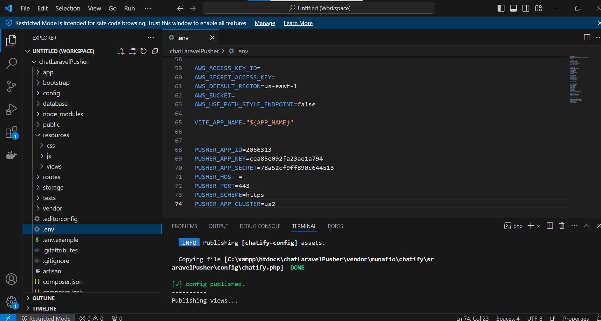
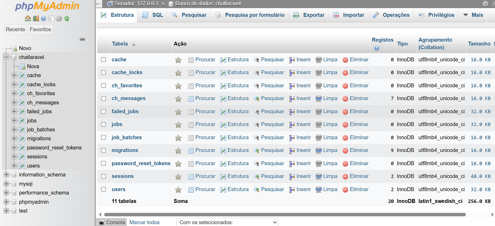
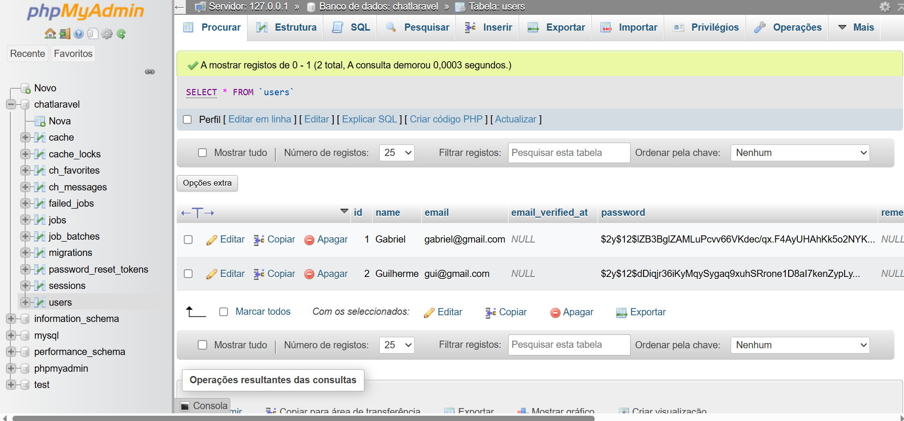
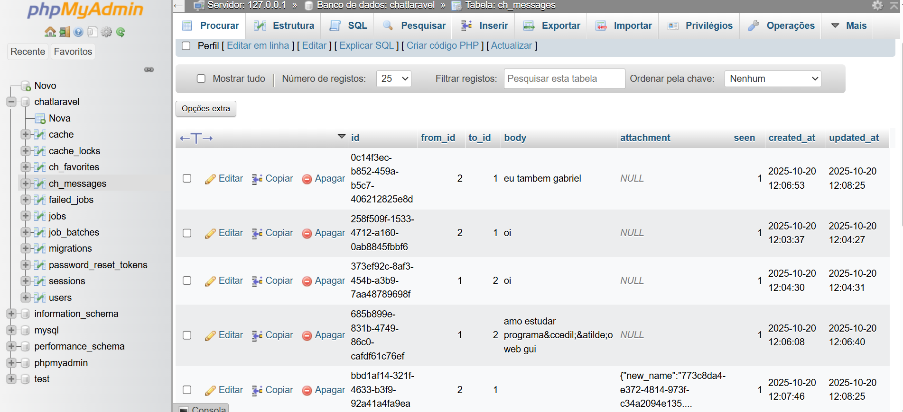
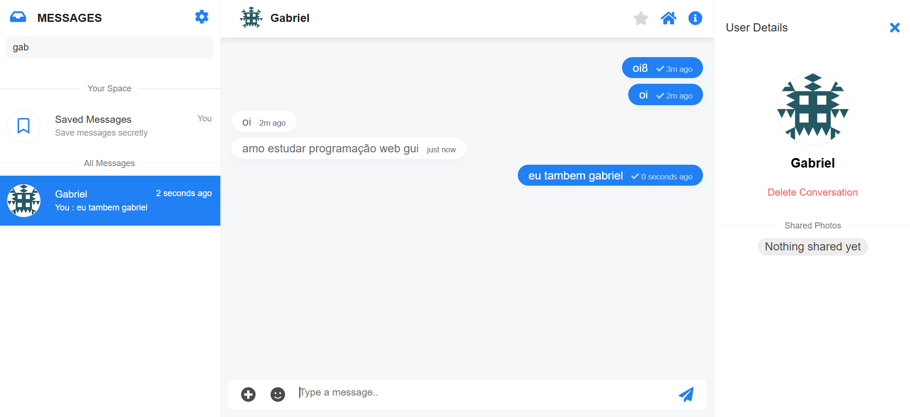
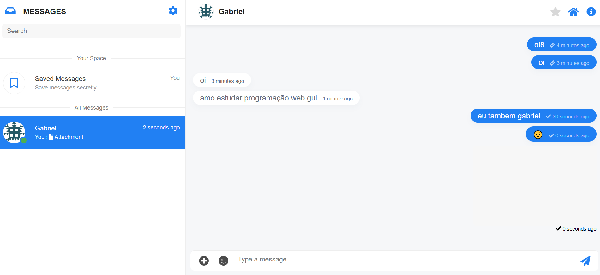

# Chat Laravel com Breeze e Chatify

Projeto desenvolvido em **Laravel**, utilizando **Breeze para autenticação** e **Chatify** para sistema de chat em tempo real com Pusher.

---

## 📌 Índice

* [Sobre o Projeto](#sobre-o-projeto)
* [Requisitos](#requisitos)
* [Instalação do Projeto](#instalação-do-projeto)
* [Instalação do Breeze](#instalação-do-breeze)
* [Instalação do Chatify](#instalação-do-chatify)
* [Banco de Dados (SGBD)](#banco-de-dados-sgbd)
* [Comentário do Algoritmo](#comentário-do-algoritmo)
* [Execução do Chat](#execução-do-chat)
* [Imagens do Projeto](#imagens-do-projeto)
* [Créditos](#créditos)

---

## 🚀 Sobre o Projeto

Este projeto é um sistema de chat em tempo real com autenticação completa, onde usuários podem se registrar e trocar mensagens instantaneamente. Ideal para aprendizado ou implementação em sistemas maiores.

---

## ✅ Requisitos

```bash
PHP >= 8.1
Composer
Node.js e NPM
MySQL ou MariaDB
Extensões: fileinfo, pdo_mysql
```

---

## 📥 Instalação do Projeto

```bash
git clone https://github.com/SEU_REPOSITORIO/chatLaravelPusher.git
cd chatLaravelPusher
composer install
cp .env.example .env
php artisan key:generate
npm install
npm run dev
php artisan migrate
```

---

## 🔐 Instalação do Breeze

```bash
composer require laravel/breeze --dev
php artisan breeze:install
npm install && npm run dev
php artisan migrate
```

### ✨ Código de instalação:

```
'composer require laravel/breeze --dev'
'php artisan breeze:install'
'npm install && npm run dev'
```

---

## 💬 Instalação do Chatify

```bash
composer require munafio/chatify
php artisan vendor:publish --tag=chatify
php artisan migrate --seed
```


---

## 🗄 Banco de Dados (SGBD)

### 📷 Estrutura do Banco

*Abaixo estão 3 imagens da estrutura do SGBD:*





---

## 🧠 Comentário do Algoritmo

O sistema utiliza **Laravel Breeze** para criar as rotas e telas de autenticação.
Após o login, o usuário tem acesso ao chat fornecido pelo **Chatify**, que se integra com o Pusher para fornecer mensagens em tempo real via WebSockets.
A lógica principal consiste em:

* Autenticar usuário
* Inicializar canal privado no Pusher
* Capturar mensagens e exibir instantaneamente
* Armazenamento das mensagens no banco de dados automaticamente

---

## ▶ Execução do Chat

Após todas as instalações, execute:

```bash
php artisan serve
npm run dev
```

Acesse: `http://localhost:8000/chatify`

### 📷 Interface do Chat (2 imagens):





---

## 📚 Autor

Desenvolvido por: **Gabriel Santos**
Frameworks: Laravel, Breeze, Chatify
Ano: 2025
Fique à vontade para contribuir com melhorias através de pull requests!
